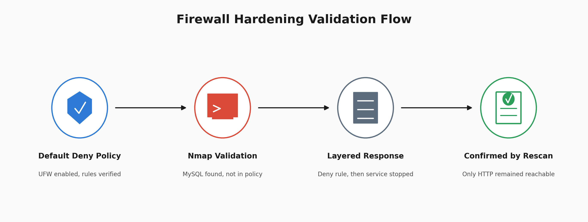

# Firewall Hardening and Service Exposure Remediation

Building a default deny UFW policy, validating it with Nmap, finding an exposed MySQL service the original policy never accounted for, and closing it.



The workflow moved from firewall policy to validation, remediation, and final verification.

The key lesson was simple: a firewall rule, a running service, and a scan result are three different claims. Each needs its own evidence.

## At a Glance

| Field | Detail |
| --- | --- |
| Task Type | Host firewall hardening and service exposure remediation |
| Tools Used | UFW, Nmap 7.99, systemctl |
| Host | Kali Linux VM, localhost |
| Default Inbound Policy | Deny |
| Allowed by Policy | SSH 22, HTTP 80, HTTPS 443 |
| Denied by Policy | Telnet 23, FTP 21, RDP 3389, MySQL 3306 |
| Observed Open During Validation | HTTP 80, MySQL 3306 |
| Final Observed State | HTTP 80 open |
| Outcome | MySQL exposure found during validation and closed with a layered response |

## What Happened

I built a default deny firewall policy on a Kali Linux host.

SSH, HTTP, and HTTPS were allowed by policy. Telnet, FTP, and RDP were explicitly denied.

I then used Nmap to validate what was actually reachable.

The scan found two open ports:

```text
80/tcp    open    http
3306/tcp  open    mysql
```

MySQL was not part of the original firewall policy.

I added a UFW deny rule for 3306/tcp and verified that the rule appeared in the policy.

I also stopped the MySQL service directly.

A final Nmap scan showed only 80/tcp open.

There is no scan captured between adding the UFW rule and stopping MySQL. Because of that, this project does not claim that the firewall rule alone failed or succeeded.

The evidence supports the full remediation sequence and the final validated state.

## UFW Enablement


I first checked whether UFW was running.

```bash
sudo ufw status
```

The firewall was inactive.

I enabled it and confirmed that it would remain enabled at system startup.

```bash
sudo ufw enable
```

This matters because firewall rules provide no protection while the firewall itself is inactive.

## Default Deny Policy


I verified the firewall configuration with:

```bash
sudo ufw status verbose
```

The output confirmed:

```text
Status: active
Logging: on (low)
Default: deny (incoming), allow (outgoing), deny (routed)
```

The default deny policy means unsolicited incoming traffic is denied unless a rule explicitly permits it.

Logging was also enabled, providing visibility into firewall activity.

## Initial Rule Set


I reviewed the active rules with:

```bash
sudo ufw status numbered
```

The policy allowed:

```text
22/tcp   SSH
80/tcp   HTTP
443/tcp  HTTPS
```

The policy explicitly denied:

```text
23/tcp    Telnet
21/tcp    FTP
3389/tcp  RDP
```

The explicit deny rules are redundant under a default deny policy, but they make the intended security policy visible during review.

IPv4 and IPv6 entries were both present.

## Validation Scan and Discovery


I validated the host with:

```bash
sudo nmap -sT localhost
```

The scan returned:

```text
PORT      STATE SERVICE
80/tcp    open  http
3306/tcp  open  mysql
```

This exposed an important difference between firewall configuration and actual service exposure.

SSH 22 and HTTPS 443 were allowed by policy, but this scan did not observe either port listening.

HTTP 80 was both allowed and observed open.

MySQL 3306 was observed open even though it was not part of the original policy design.

The firewall configuration described what traffic should be permitted.

Nmap showed what was actually reachable from the scan's vantage point.

## Firewall Remediation


I added an explicit deny rule for MySQL:

```bash
sudo ufw deny 3306/tcp
```

UFW confirmed that the rule was added for both IPv4 and IPv6.

This changed the firewall policy so that MySQL was explicitly denied.

## Rule Verification


I reloaded UFW and reviewed the numbered rules.

```bash
sudo ufw reload
sudo ufw status numbered
```

The output confirmed:

```text
3306/tcp    DENY IN    Anywhere
3306/tcp    DENY IN    Anywhere (v6)
```

The final policy contained seven unique service rules, with corresponding IPv6 entries.

This proves that the MySQL deny rule existed in the firewall policy.

It does not independently prove what happened to port 3306 immediately after the rule was added because I did not capture an Nmap scan at that point.

That distinction is important.

Configuration evidence proves configuration.

Validation evidence proves observed behavior.

## Service Shutdown and Final Validation


I also stopped the MySQL service directly:

```bash
sudo systemctl stop mysql
```

Then I performed the final validation scan:

```bash
sudo nmap -sT localhost
```

The result showed:

```text
PORT   STATE SERVICE
80/tcp open  http
```

MySQL 3306 no longer appeared.

Stopping an unnecessary service reduces attack surface directly because the service is no longer listening.

The final scan confirmed the end state rather than assuming the remediation worked.

## Firewall Policy

| Port | Service | Action | Reason |
| --- | --- | --- | --- |
| 22/tcp | SSH | Allow | Encrypted remote administration |
| 80/tcp | HTTP | Allow | Web server traffic |
| 443/tcp | HTTPS | Allow | Encrypted web traffic |
| 21/tcp | FTP | Deny | Cleartext protocol not required |
| 23/tcp | Telnet | Deny | Cleartext protocol not required |
| 3389/tcp | RDP | Deny | Remote access service not required |
| 3306/tcp | MySQL | Deny | Database service not required for inbound access |

## Exposure Finding

| Field | Detail |
| --- | --- |
| Port | 3306/tcp |
| Service | MySQL |
| Discovery | Nmap validation scan against localhost |
| Initial State | MySQL observed listening on 3306/tcp |
| Firewall Action | UFW deny rule applied |
| Rule Verification | 3306/tcp confirmed as DENY IN |
| Service Action | MySQL stopped with systemctl |
| Final Validation | Nmap showed only 80/tcp open |
| Status | Remediated and final state verified |

## Exposure Indicators

| Type | Indicator | Source |
| --- | --- | --- |
| Observed Service | MySQL on 3306/tcp | Initial Nmap scan |
| Observed Open Ports | 80/tcp, 3306/tcp | Initial Nmap scan |
| Allowed by Policy | SSH 22, HTTP 80, HTTPS 443 | UFW policy |
| Explicitly Denied by Policy | Telnet 23, FTP 21, RDP 3389 | UFW policy |
| Added Remediation Rule | MySQL 3306 DENY IN | UFW policy |
| Final Observed State | HTTP 80 only | Final Nmap scan |

## MITRE ATT&CK Context

### T1046: Network Service Discovery

Nmap was used to identify listening services on the host.

This demonstrates the same type of service discovery activity represented by T1046.

The project did not observe an attacker performing this technique. Nmap was used by the analyst for defensive validation.

The firewall rules for SSH, RDP, and other services represent attack surface decisions rather than evidence that MITRE ATT&CK techniques involving those services occurred.

For that reason, T1046 is the primary ATT&CK technique demonstrated by the lab.

## Analyst Findings

The host firewall was enabled and configured with default deny for incoming traffic.

SSH 22, HTTP 80, and HTTPS 443 were allowed by policy.

Telnet 23, FTP 21, and RDP 3389 were explicitly denied.

The initial Nmap validation scan observed HTTP 80 and MySQL 3306 open.

SSH and HTTPS were permitted by policy but were not observed listening in that scan.

MySQL 3306 was not accounted for in the original policy.

A deny rule for 3306/tcp was added and confirmed in UFW.

The MySQL service was then stopped directly.

The final Nmap scan showed only HTTP 80 open.

The project does not claim that the UFW rule alone closed or failed to close MySQL because no scan was captured between the firewall change and the service shutdown.

## Analyst Verdict

The firewall policy was successfully hardened and the unexpected MySQL exposure was identified during validation.

The final state was verified with Nmap rather than inferred from the firewall configuration.

The strongest finding was not simply that port 3306 existed.

It was that security configuration and actual host exposure must be validated separately.

## Recommended Response

Keep default deny as the inbound firewall baseline.

Document why every allowed service needs to remain reachable.

Validate firewall changes with a scan instead of relying only on the ruleset.

Capture a validation scan after each individual remediation action.

Review listening services regularly with:

```bash
ss -tulpn
```

Stop or reconfigure services that do not need to be listening.

Forward firewall logs into the SIEM where they can support monitoring and investigation.

Repeat exposure scans periodically to identify configuration drift or newly introduced services.

## What This Lab Demonstrates

This project demonstrates how I can:

* Build and verify a default deny host firewall policy.
* Review allowed and denied network services.
* Validate actual service exposure with Nmap.
* Distinguish policy configuration from observed network state.
* Identify a service missing from the original policy.
* Add and verify a remediation rule.
* Reduce attack surface by stopping an unnecessary service.
* Confirm the final state with a rescan.
* Recognize where the evidence does not support a stronger conclusion.

## Lessons Learned

The most important lesson came from reviewing the project's own evidence.

I did not capture a scan between adding the UFW deny rule and stopping MySQL.

That means I cannot prove what effect the firewall rule had by itself.

The original explanation went further than the evidence supported.

Correcting that changed how I think about remediation evidence.

A configuration change is evidence that an action was taken.

A configuration check is evidence that the change exists.

A rescan is evidence of the observed result.

Those are different claims and should not be treated as interchangeable.

## What I Would Improve

I would capture an Nmap scan immediately after every individual remediation action.

That would let me verify the effect of the firewall rule separately from the effect of stopping the service.

I would also run:

```bash
ss -tulpn
```

alongside Nmap.

This would let me compare what the operating system reports as listening with what the scanner can actually reach.

If loopback filtering became relevant to the investigation, I would test that behavior directly and capture the result before using it as the explanation.

## Repository Structure

```text
.
├── README.md
└── screenshots/
    ├── 00_architecture.png
    ├── 01_ufw_enabled.png
    ├── 02_ufw_default_policy.png
    ├── 03_ufw_rules_numbered.png
    ├── 04_nmap_scan_results.png
    ├── 05_ufw_deny_mysql.png
    ├── 06_ufw_final_rules.png
    └── 07_nmap_post_remediation.png
```

---

## Author

William Gokah

SOC Analyst Portfolio

[](https://linkedin.com/in/WilliamInCyber) [](https://x.com/WilliamInCyber)
